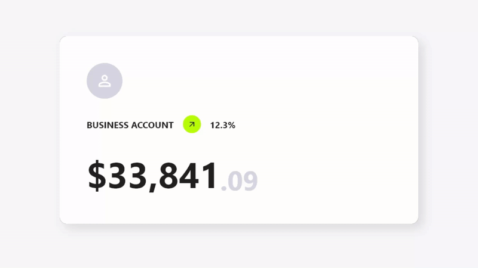
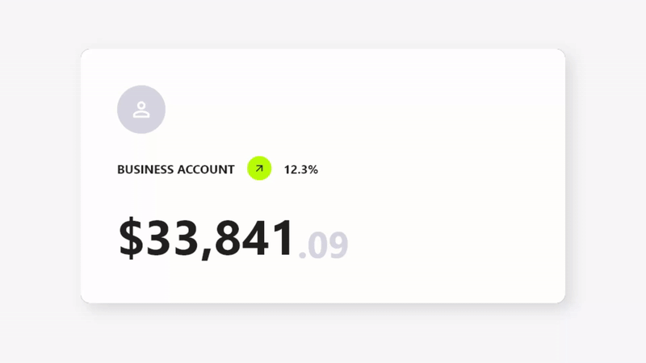
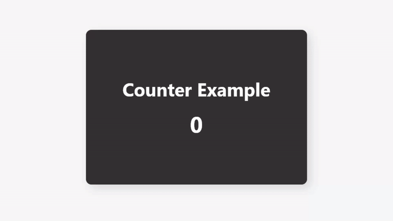

## Features

- ✨ Simple Use
- ⚙️ Great Customization
- 🌍 Expand the functionality of your cards
- 🛑 Not use for mobile devices, will soon be available for use on those platforms.

## Getting Started

To use this card actions package, you need to add the dependencies in `pubspec.yaml` file.

```yaml
dependencies:
    card_actions: ^0.0.1
```

## Use

To use card actions is very simple, just wrap your **card** with our `CardActions` widget,

```dart
CardActions(
    ...
    child: YourCard() // here would be your card
)
```

### Basic Setup

**CardActions** needs the parameters `width`, `height` and `actions`

- `width` is the width of the widget
- `height` is the height of the widget
- `actions` is a list of `CardActionButton`.

```dart
CardActions(
    width: //your card width
    height: // your card height
    actions: <CardActionButton>[
        CardActionButton(
            icon: Icon(
                Icons.edit,
                color: Colors.white,
            ), // Icon
            label: 'edit',
            onPress: () {},
        ), // CardActionButton
    ]
    child: yourCard(), // here would be your card 
)
```



You can add more buttons if you prefer

```dart
...
actions: [
    CardActionButton(
        icon: Icon(
            Icons.edit,
            color: Colors.white,
        ),
        label: 'edit',
        onPress: () {},
    ),
    CardActionButton(
        icon: Icon(
            Icons.payment_rounded,
            color: Colors.white,
        ),
        label: 'Pay',
        onPress: () {},
    ),
    CardActionButton(
        icon: Icon(
            Icons.remove_red_eye_sharp,
            color: Colors.white,
        ),
        label: 'Preview',
        onPress: () {},
    ),
]
```


### Axis Direction

If you want to change the direction of the hover, you can use the `axisDirection` property of the `CardAction` to change it.

the `axisDirection` property receives a **enum** of type `CardActionAxis` at the moment we only have **bottom** and **right**.

| CardActionAxis.bottom | CardActionAxis.right     |
|-----------------------|--------------------------|
|  |  |


## Example



To make this example, we will need to configure more things, but it will be very simple, the first thing is that we change the background color for it we have to use the property `backgroundColor` then an important part is that we change the design of the cursor when it is on top of the buttons and this we can do it in two ways:

- In the `CardAction` we have the `buttonsCursor` property that serves to change the cursor to **ALL** the buttons.

- In the `CardActionButton` we have the `cursor` property to change the cursor to that specific button.

> **Important**.
> If you use both options at the same time the button will prioritize its own `cursor` setting over the global setting with `buttonsCursor`.

and finally we add the necessary functions to the buttons by means of its `onPress` method.

```dart
...
actions: [
    CardActionButton(
        icon: Icon(
            Icons.add,
            color: Colors.white,
            size: 30,
        ),
        label: 'Increment',
        onPress: increment // method to increase the counter,
    ),
    CardActionButton(
        icon: Icon(
            Icons.restore_sharp,
            color: Colors.white,
            size: 30,
        ),
        label: 'Reset',
        onPress: () {
            // reset the counter
            setState(() {
            counter = 0;
            });
        },
    ),
    CardActionButton(
        icon: Icon(
            Icons.remove,
            color: Colors.white,
            size: 30,
        ),
        label: 'Decrement',
        onPress: decrement // method for decrementing the counter
    ),
]
```

## RoadMap
- Add options to handle card animation.
- Make it usable on mobile devices, but instead of hover, click on the card, or hold down.
- Add more axes and even be able to use several at the same time.

## Parameters 

### CardActions

| Property                     | Type           | Default                  | Description                                             |
|------------------------------|----------------|--------------------------|---------------------------------------------------------|
| width                        | double         | required                 | widget width                                            |
| height                       | double         | required                 | widget height                                           |
| cardCursor                   | MouseCursor    | SystemMouseCursors.basic | the type of cursor displayed when hovering on the card  |
| buttonsCursor                | MouseCursor    | SystemMouseCursors.basic | the type of cursor displayed when hovering over buttons |
| borderRadius                 | double         | 0                        | rounded card edges                                      |
| showToolTip                  | bool           | true                     | Show/Hide toolTips                                      |
| axisDirection                | CardActionAxis | CardActionAxis.bottom    | CardActions Axis Direction                              |
| splashColor                  | Color          | Colors.white24           | Splash color when hovering                              |
| backgroundColor              | Color          | Color(0xff242120)        | Background color                                        |
| closeCardWhenExecuteFunction | bool           | false                    | close the card when you press a button                  |

### CardActionButton

| Property           | Type         | Default  | Description                                       |
|--------------------|--------------|----------|---------------------------------------------------|
| icon               | Icon         | required | Button icon                                       |
| label              | String       | required | text to be displayed in the Tool Tip              |
| onPress            | VoidCallback | required | callback to be executed when you press the button |
| closeCardWhenPress | bool         | false    | when you press the button, the card closes.       |
| cursor             | MouseCursor? | null     | Cursor displayed when hovering on the button      |